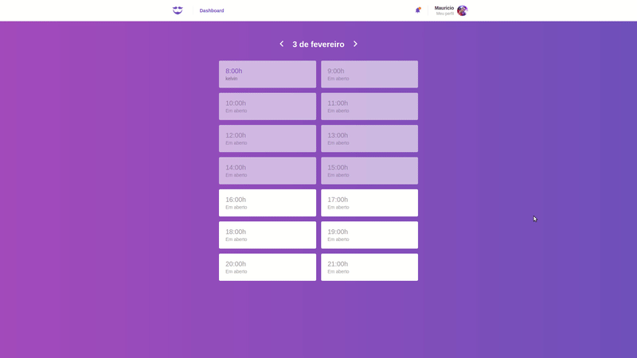

<h1 align="center">
  
</h1>

<h2 align="center">
  Sistema completo para gerenciar agendamentos de barbearias
</h2>

  <a href="#sobre-o-projeto">Sobre o projeto</a>&nbsp;&nbsp;&nbsp;|&nbsp;&nbsp;&nbsp;
  <a href="#lista-de-correspondências">Lista de correspondências</a>&nbsp;&nbsp;&nbsp;|&nbsp;&nbsp;&nbsp;
  <a href="#execução">Execução</a>&nbsp;&nbsp;&nbsp;|&nbsp;&nbsp;&nbsp;
  <a href="#licença">Licença</a>

---

## Sobre o projeto
Este projeto é fruto do desenvolvimento continuo realizado por vários módulos do bootcamp GoStack 10, para consultar os demais projetos provenientes deste curso acesso o repositório [GoStack](https://github.com/mauricio-andre/goStack10).

Para a compreensão do processo evolutivo deste projeto, a sessão [Lista de correspondência](#lista-de-correspondência) elenca os módulos e seus títulos que remetem a parte de sua construção.

O backend desta aplicação é uma API REST que fornece as funcionalidades para o ambiente web utilizado pelo provedor do serviço e para a aplicação mobile utilizado por clientes da barbearia, dentro do diretório backend ha uma pasta chamada [client](./packages/backend/client), dentro desta está um conjunto de arquivos que correspondem as diferentes rotas disponíveis da API, se você estiver usando o vc code como editor, pode instalar a extensão *REST Client* para executar os exemplos de rotas fornecidos.

Por meio da aplicação WEB é possível se cadastrar como provedor de serviços, consultar sua agenda de atividades para qualquer dia, editar os dados do seu perfil e visualizar notificações recebidas informando sobre a reserva ou cancelamento de algum cliente.

  

A aplicação mobile fornece acesso as funcionalidades para o cliente, o mesmo pode se cadastrar, consultar todos os seus agendamentos, buscar por barbeiros cadastrados, agendar um horário com um barbeiro disponível e editar os dados do seu perfil.

  

## Lista de correspondências

- Modulo 2: Iniciando back-end do GoBarber
- Modulo 3: Continuando API do GoBarber
- Modulo 9: GoBarber web
- Modulo 12: Deploy no NodeJS
- Modulo 14: Deploy no ReactJS e React Native
- Modulo 15: Patterns e recursos avançados
- Modulo 16: Segurança no NodeJS

## Execução
Para executar este projeto será necessário instalar as seguintes ferramentas:
- Node ^12.16.1
- yarn ^1.22.5

Será necessário a instalação dos seguintes bancos de dados:
- Postgres
- Redis
- Mongo

Você pode instalar esses bancos diretamente em seu ambiente ou usar um container para isso, esse projeto acompanha um arquivo [docker-compose.yml](./docker-compose.yml) que pode ser usado para subir facilmente os bancos de dados necessários, para executa-lo é necessário ter em seu ambiente o docker e o docker compose instalados, tendo-os devidamente configurados em seu ambiente acesse o diretório deste projeto pelo terminal e execute o comando `docker-compose up`

Antes de executar o projeto web ou mobile, é necessário inicializar o backend, para isso sia os passos descritos abaixo:
- Acesse o diretório do projeto e execute o comando yarn para baixar todas as dependências do projeto
- Acesse o diretório [packages/backend](./packages/backend) e faça uma cópia do arquivo .env.exemple
- Renomeie o arquivo copiado para .env e altere as variáveis de ambiente de acordo com o necessário
- Execute o comando `yarn sequelize db:migrate` para criar as tabelas do banco de dados
- Execute o comando `yarn dev` para executar a API
- Execute o comando `yarn queue` para executar o sistema de envio de email

Para iniciar o ambiente web acesse o diretório [packages/web](./packages/web) pelo terminal e execute o comando `yarn start`

Para executar a parte mobile deste projeto você vai precisar instalar um emulador de celular em seu computador, ou conectar seu dispositivo físico ao computador estando esse devidamente configurado para permitir instalações de programas fora da loja oficial de seu provedor. Este projeto não foi testado em um dispositivo IPhone.

Acesse o diretório [packages/mobile](./packages/mobile) pelo terminal e execute o comando `yarn android` se o seu dispositivo físico ou emulado for um android, ou `yarn ios` se o mesmo for um IPhone, este comando vai instalar o app em seu celular, após a instalação se o bundle não for executado automaticamente, execute o comando `yarn start`, pode ser necessário fechar e abrir novamente o seu app em seu celular.

## Licença
Esse projeto está sob licença MIT, veja o arquivo de [LICENSE](./LICENSE) para mais detalhes
